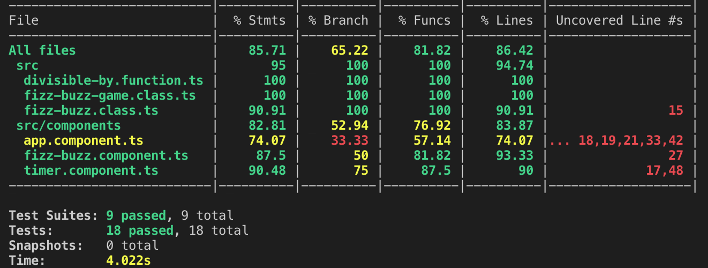

# 💻 Interactive CLI

---

import {Gyphy} from '../components/gyphy';

# Its time for a demo.

<Gyphy height="200" id='KPPS9YOCBGU5G'/>

---

# 📊 Code Coverage

---

import {Appear} from 'mdx-deck'
import {CodeSlide} from '../components/code-slide';

<CodeSlide lang="bash" highlights={[{line: 0}]} code="jest --coverage" />

<Appear>
    
    
Also generates reports in lcov format

</Appear>